# **KS0397 EASY PLUG Super Starter Kit For Mixly**

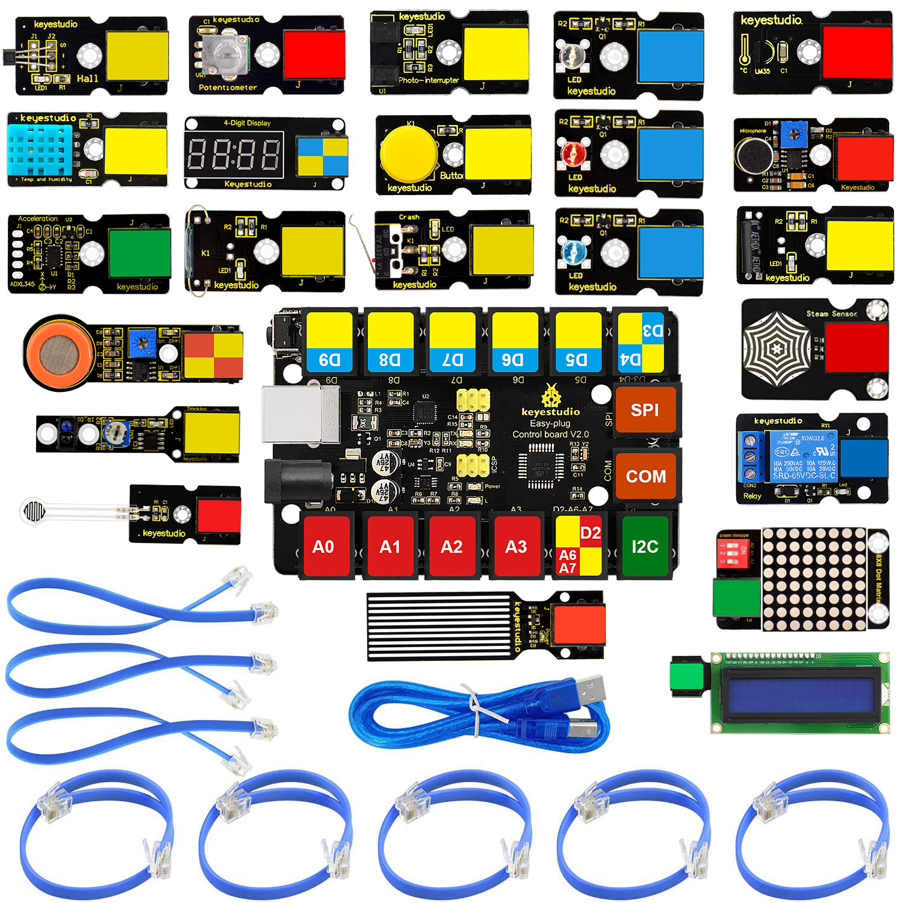

# 1. Kit Description

The keyestudio EASY PLUG super starter kit is based on Mixly blocks coding, very easy to use and flexible.

This kit includes everything you need to complete Mixly projects that will teach you how to control and read external sensors and displays, control matrix, learn Mixly Blocks programming, and much more.

Although you have a few or even no electronics related knowledge, you can use this kit to realize your creative ideas as long as you want to. 

After using this kit you’ll have the know-how to start creating your own amazing experiments. Share your own creative works with your intimate family, friends or classmates.

Let’s get started right now!

# 2. Kit List

| **No.** |                  **Component**                  | **Quantity** |                     **Picture**                     |
| :-----: | :---------------------------------------------: | :----------: | :-------------------------------------------------: |
|    1    |          EASY plug Control Board V2.0           |      1       |   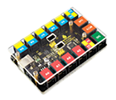   |
|    2    |           EASY plug White LED Module            |      1       |  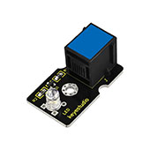   |
|    3    |            EASY plug Blue LED Module            |      1       |  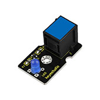   |
|    4    |            EASY plug Red LED Module             |      1       |  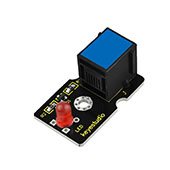   |
|    5    |       EASY plug thin-film pressure sensor       |      1       |  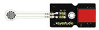   |
|    6    |          EASY plug Analog Sound Sensor          |      1       |  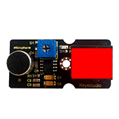   |
|    7    |          EASY plug Water Level Sensor           |      1       |  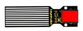   |
|    8    |         EASY plug Potentiometer Sensor          |      1       |  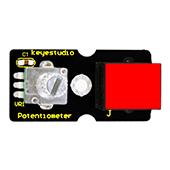   |
|    9    |         EASY plug Analog Alcohol Sensor         |      1       |  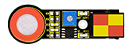   |
|   10    |    EASY plug LM35 Temperature Sensor Module     |      1       |  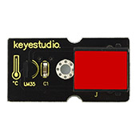   |
|   11    |      EASY plug Digital Tilt Sensor Module       |      1       |  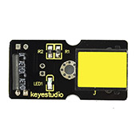   |
|   12    |             EASY plug Steam Sensor              |      1       |   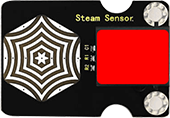   |
|   13    |         EASY plug Hall Magnetic Sensor          |      1       |  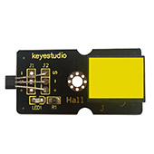   |
|   14    |             EASY plug Crash Sensor              |      1       |  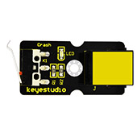   |
|   15    |          EASY plug Digital Push Button          |      1       |  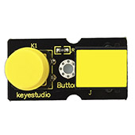   |
|   16    |          EASY plug Reed Switch Module           |      1       |  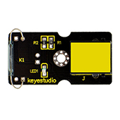   |
|   17    |         EASY plug Line Tracking Sensor          |      1       |  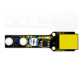   |
|   18    |       EASY plug Photo Interrupter Module        |      1       |  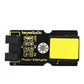   |
|   19    |          EASY plug Single Relay Module          |      1       |  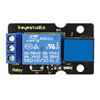   |
|   20    |      EASY plug ADXL345 Acceleration Module      |      1       |  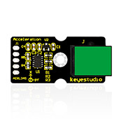   |
|   21    | EASY plug DHT11 Temperature and Humidity Sensor |      1       |  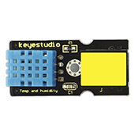   |
|   22    |            EASY plug 8x8 LED Matrix             |      1       |  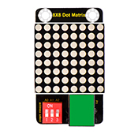   |
|   23    |            EASY plug 1602 LCD Module            |      1       |  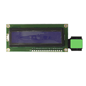   |
|   24    |          EASY plug 4-digit LED display          |      1       |  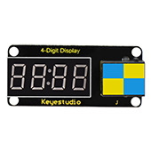   |
|   25    |              200mm blue RJ11 cable              |      5       |  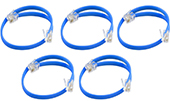   |
|   26    |              300mm blue RJ11 cable              |      3       |   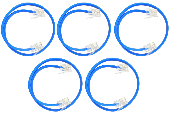   |
|   27    |                    USB cable                    |      1       |   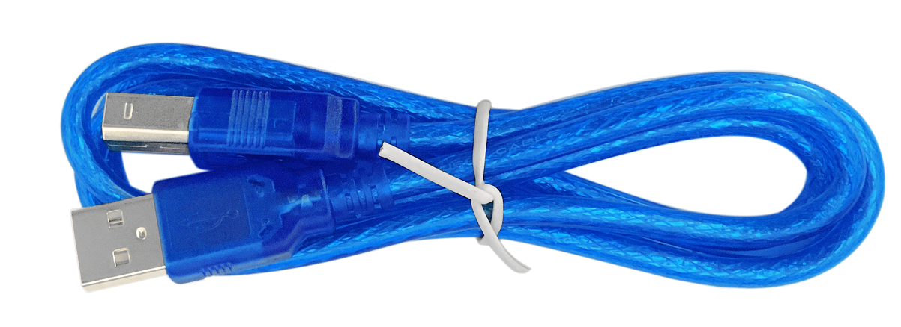   |
|   28    |                 Acrylic Boards                  |      1       |   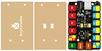   |
|   29    |        Dual-pass M3\*15MM Copper Pillar         |      4       | 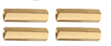 |
|   30    |            M3\*10MM Round-head Screw            |      8       |   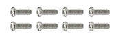   |

# 3. Install Mixly and Driver

Download Mixly

**① Introduction for Mixly**

Mixly is a free open-source graphical Arduino programming software, based on Google’s Blockly graphical programming framework, and developed by Mixly Team@ BNU.

It is a free open-source graphical programming tool for creative electronic development; a complete support ecosystem for creative e-education; a stage for maker educators to realize their dreams.

Although there is an Ardublock graphical programming software launched by Arduino official, Ardublock is not perfect enough, and many common functions cannot be realized.

**②Download and install Mixly1.0 software**

There are two kind installation packages provided for you in the following links:

[Mixly1.0 for Win7/8/10](http://116.62.49.166/Mixly_WIN.7z)：<https://fs.keyestudio.com/Mixly1-Windows>

[Mixly1.0 forMac](https://116.62.49.166/MixlyMac.zip)：<https://fs.keyestudio.com/Mixly1-MACOS>

**Windows version：**

We will take Mixly1.0 (Windows version) as example.

**Install Software：**

You will get installation package after downloading. As shown below:

Unzip the package, you will see “Mixly 1.0 for keyestudio.exe”

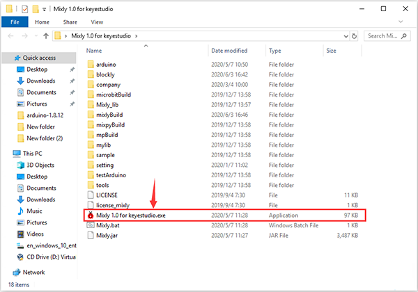

Double-click ”Mixly 1.0 for keyestudio.exe”, the following interface pops up.

We have to choose correct Arduino development board and name, as shown below:

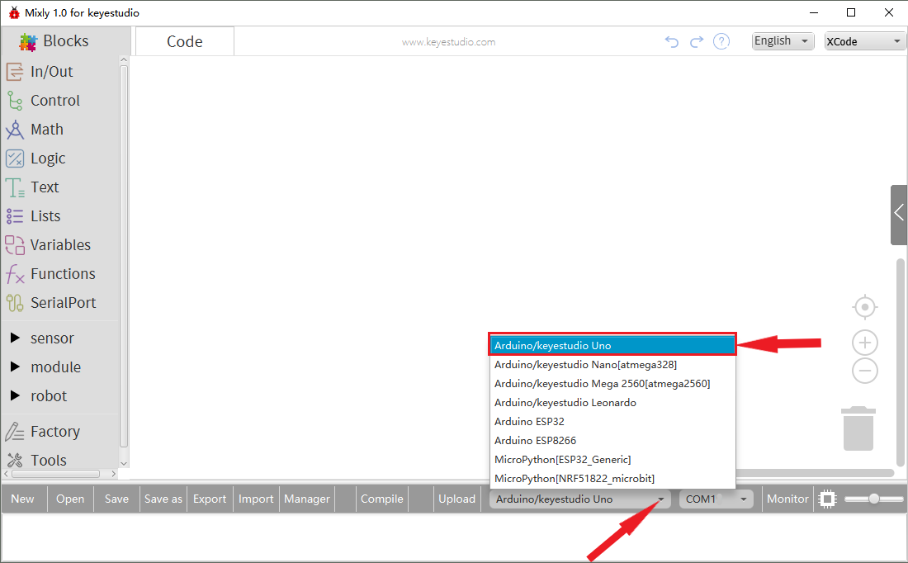

Select correct COM port(the corresponding port will be shown after installing driver successfully)

You have to know the function of every area and interface on Mixly software before uploading program on Arduino development board.

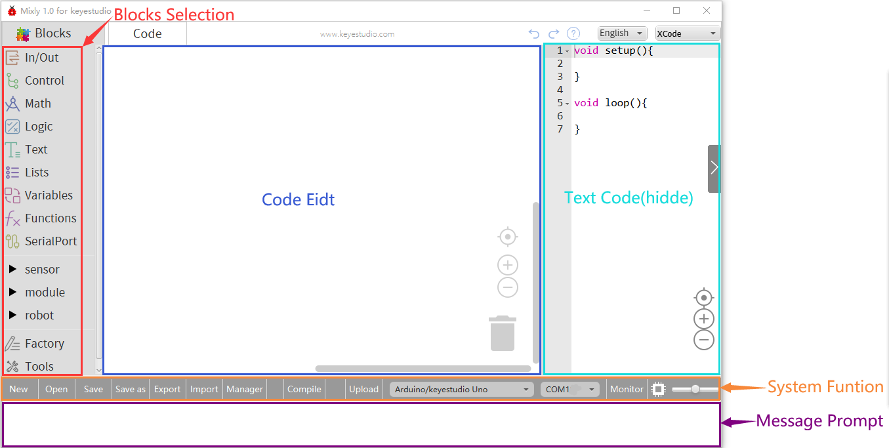

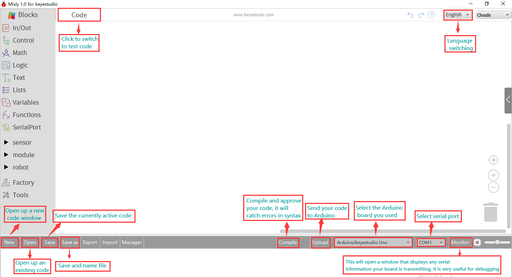

More information about Mixly 1.0 for keyestudio:<[Getting Started with Mixly 1.0 - Keyestudio Wiki](https://wiki.keyestudio.com/Getting_Started_with_Mixly_1.0)>

Install the driver of the development board

Next, we will introduce the driver of the development board. The driver installation may have slight differences in different computer systems. So in the following let’s take an example of the driver installation in the WINDOWS system.

Mixly 1.0 for keyestudio folder contains its software and driver files. Before we launch the Mixly software, you only need to install the USB drivers. 

Double-click the Mixly 1.0 for keyestudio folder—\> arduino—\>drivers

The driver files are shown below:

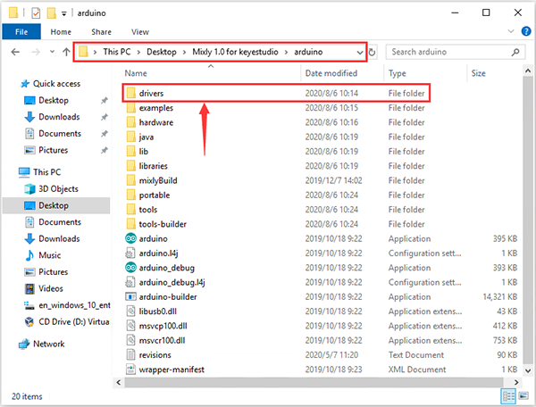

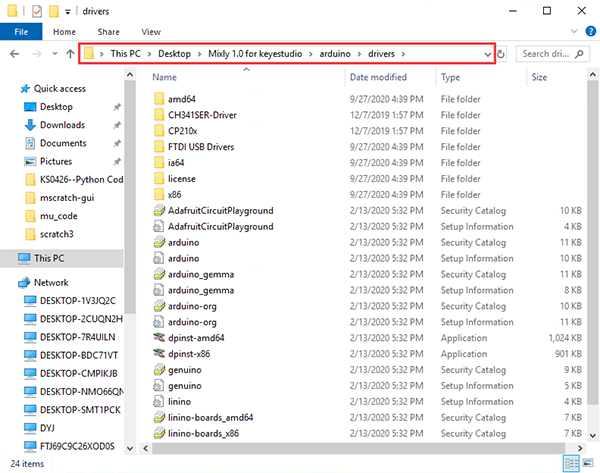

Connect the EASY Plug control board V2.0 to the computer with a USB cable.

Right click the icon of your“Computer”—\>“Properties”—\>“Device manager”.

If your computer is Windows10, the USB Serial Device(COM8) will be shown. That indicates that the USB driver is installed. But for other systems like Windows 7 or 8, you may have to install the USB driver manually.

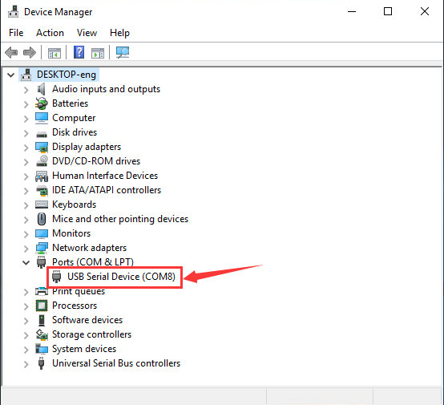

Right-click **USB Serial Device(COM8)** to select **Update driver**

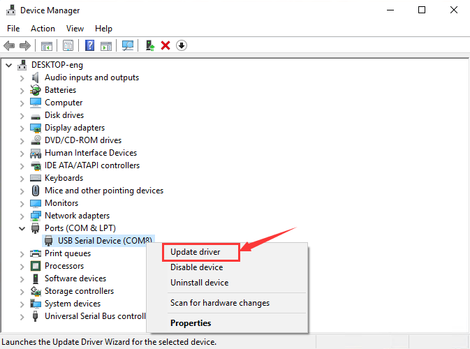

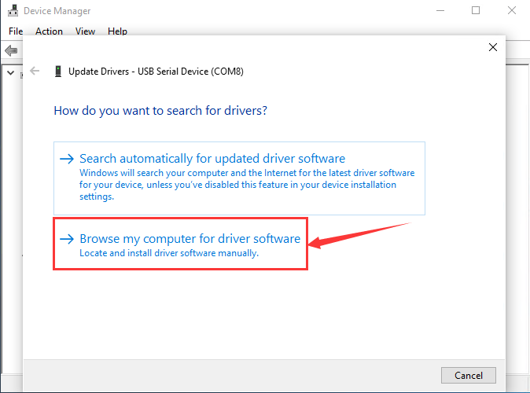

Click “browse my computer for updated driver software”, find out the drivers folder and enter “driver” to search in rectangular box.

Click “Next”, the driver will be installed successfully.

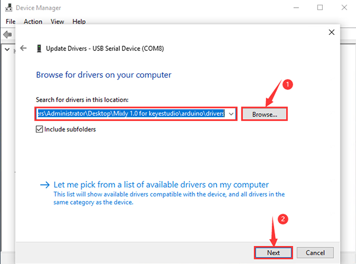

Click **Install** to wait for the installation

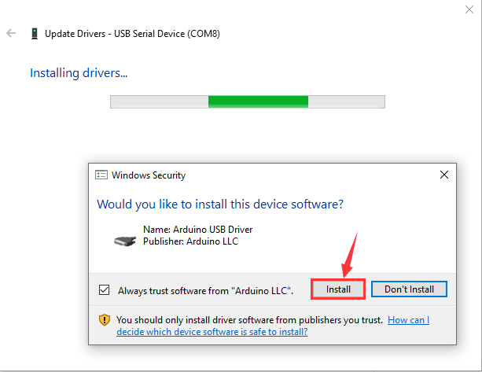

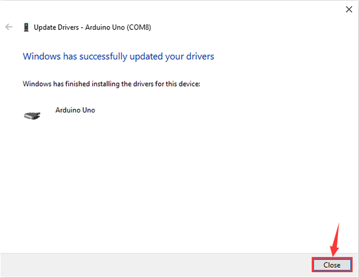

Click **Close** and you can see the following device in the Device Manager.

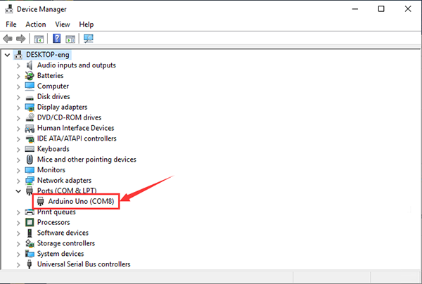

When you connect the board to your computer at the first time, right click the icon of your *“Computer” —\>for “Properties”—\> click “Device manager”*, under “Other Devices”, you should see an icon for “Unknown device” with a little yellow warning triangle next to it.

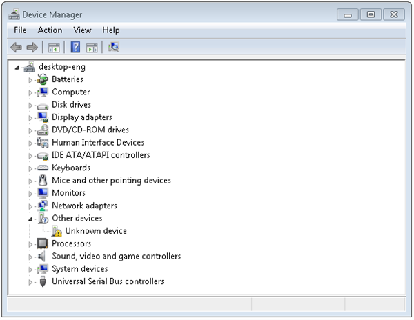

Then right-click on the device and select the top menu option (Update Driver Software...) shown as the figure below.

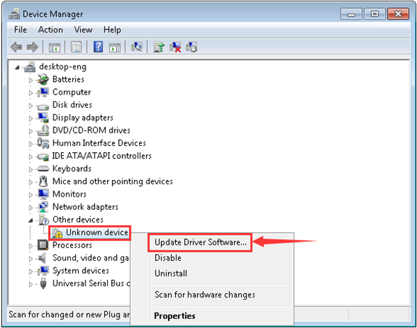

It will then be prompted to either “Search Automatically for updated driver software” or “Browse my computer for driver software”. Shown as below. In this page, select “Browse my computer for driver software”.

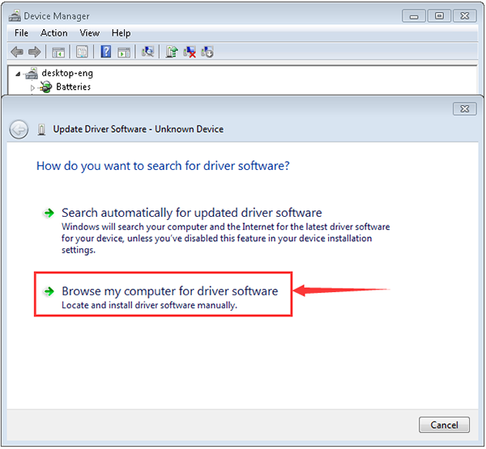

Click “Browse”, then find out the drivers folder and enter “driver” to search in rectangular box.

Click “Next”, the driver will be installed successfully. (I place Arduino software folder on the desktop, you could follow my way)

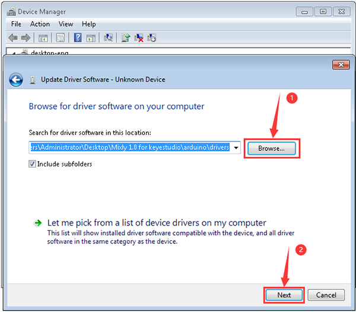

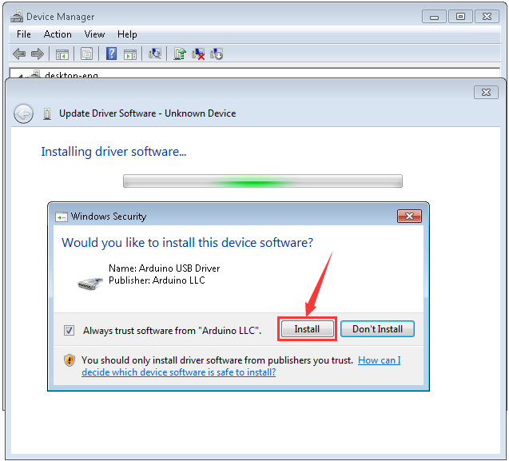

Once the software has been installed, you will get a confirmation message. Installation completed, click “Close”.

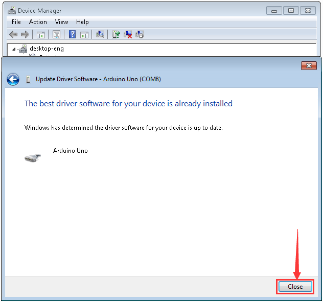

Up to now, the driver is installed well. Then you can right click*“Computer”—\>“Properties”—\>“Device manager”*, you should see the device as the figure shown below.


**Start the first program**

Click “Open”→ sample → arduino→ Arduino → 01 IN-OUT→01-LED Blink.mix


We have to choose correct Arduino development board and name, as shown below:(Note: the development board we use is the Arduino UNO board, choose Arduino/keyestudio Uno when setting board type)


The corresponding board and COM port will be shown after setting board and COM port.


Click **Compile** to start compiling the program.


Click **Upload** to upload the program


Upload successfully. After uploading the program successfully, the onboard LED lights up for 1s, lights off for 1s.

# 4. Import the Library

Open **Mixly 1.0 for keyestudio** software, click“Import”then select“Local import”, as shown below:


Double-click the folder“KS_EasyPulg”and select“KS_EasyPulg”library file


After importing it, you will see it in the blocks list. Also, the interface will show **“import custom library successfully!”**


# 5. Let’s Get Started With Your Projects

## Project 1: Hello World

**Overview**

This project is very simple. You can use only a main board and a USB cable to display the “Hello World!”. It is a communication experiment between the EASY Plug control board and PC. This is an entry experiment for you to enter the Arduino programming world.

Note that need to use a serial communication software, [Mixly 1.0 forkeyestudio](https://wiki.keyestudio.com/Getting_Started_with_Mixly1.0).

In the above part, you can check the detailed use of Mixly 1.0 for keyestudio.

**Component Required**

EASY plug control board\*1

USB cable\*1

**Component Introduction**


**keyestudio EASY plug Control Board V2.0**

The processor used in keyestudio EASY plug control board V2.0 is ATmega328. It has 5 single Digital ports labeled D5 to D9 (of which 3 can be used as PWM outputs), 1 dual-digital interface (D3-D4), 4 analog inputs (A0-A3), a Joystick socket (D2-A6-A7), a SPI, a serial port and an IIC communication interface. Also with a USB connection, a power jack, two ICSP headers and a reset button. It breaks out the IO ports with RJ11 6P6C plug.

**Connection**

Connect the control board to your computer via a micro USB cable.


Operation

**Open the Program**

Click “**Open**” to open your first program “Hello World！”. Follow the steps below.


Or you can double click or directly drag the program to open “Hello World！”. Then you should see the Blocks code, shown below.


After that, select the proper **Board** and **Port**. Upload the code to your EASY Plug control board.


**Displaying “Hello World!”**

Finally, upload the code successfully, open the monitor and set the baud rate to **9600**, you should be able to see the “Hello World” is showed on the monitor.

Congrats! You make it !


**Check Arduino Code**

What’ more, you can also click  to check the Arduino code on the right side.

Amazing! So powerful the Mixly blocks code is!


Is it more easy and simple to play the Mixly projects? Next, let's Continue to try the Mixly Block project. Begin with the following projects to motivate your creations!

## Project 2: LED Light

**Overview**

To start off the EASY Plug sensor module, we will work on an LED. That’s right - it is as simple as turning a light on and off. It might not seem like much, but establishing this important baseline will give you a solid foundation as we work toward more complex experiment.

**Component Required**

-   EASY plug control board\*1

-   EASY plug LED Module \*3

-   RJ11 cable\*1

-   USB cable\*1

**Component Introduction**

**EASY plug LED Module**


The LED light modules have shiny colors, ideal for Arduino starters. It can be easily connected to IO/Sensor shield.

Note: this module needs to be used together with EASY plug control board. You can also choose other LED to emit different color of light like blue, green, yellow and red.

-   Sensor type: Digital

-   Interface: Easy plug

-   PH2.54 socket

**Connection**

Connect the EASY Plug LED module to control board using an RJ11 cable.


**Example 1: Light up LED**

**Test Code**

Below is an example code for lighting up an LED.

**Test Result**

The LED is turned on. If it doesn’t, make sure you have assembled the circuit correctly and verified and uploaded the code to your board.


**Example 2: LED Blink**

**Test Code**

Below is an example code for LED blinking.


**Test Result**


The LED will flash on for one second, then blink off for one second.

If it doesn’t, make sure you have assembled the circuit correctly and verified and uploaded the code to your board.

**Knowledge**

If you want to make the LED flash on and off more quickly or slowly, you can modify the Delay time here.


Thank you! Enjoy the following programming.

**Example 3: LED Breath**

Here do you know how to connect the LED module? Check the code.

**Test Code**

Below is an example code for one LED breathing.


**Little Knowledge:**

Here no connection diagram, which port should you choose? Yeah, Pin 5.

See the code, you can modify the connection pin here.


**Test Result**

The LED gradually becomes brighter for one second, then gradually dimming for one second.

If it doesn’t, make sure you have assembled the circuit correctly and verified and uploaded the code to your board.

**Example 4: Brighten and Dim**

**Wiring Diagram**

Connect the three EASY Plug LED modules to control board using RJ11 cables. Connect a red LED to D9, white LED to D6, blue LED to D5.


**Test Code**

Below is an example code for three LED modules experiment.


**Test Result**

The three LEDs are gradually brighter then gradually off one by one, circularly.

If it doesn’t, make sure you have assembled the circuit correctly and verified and uploaded the code to your board.


**Troubleshooting:**

-   **LED Not Lighting Up?**

If upload the code successfully, but LED still not lights up. Make sure your board and LED module are connected correctly.

-   **Program Not Uploading?**

This happens sometimes, the most likely case is a confused Board and serial port, you should firstly select your proper board and port.


## Project 3: Line Tracking

**Overview**

If you want to build a line tracking robot, the easiest way is to use a line tracking sensor. Line following is the most basic function of smart mobile robot.

We designed this new generation of line tracking sensor to be your robot's powerful copilot all the way. It will guide your robot by telling white from black quickly and accurately, via TTL signal.

**Component Required:**

-   EASY plug control board\*1

-   EASY plug Line Tracking Sensor \*1

-   EASY plug LED Module \*1

-   RJ11 cable\*1

-   USB cable\*1

**Component Introduction:**

**EASY plug Line Tracking Sensor**


The Line Tracking Sensor can tell white from in black or black from white accurately.

The single line-tracking signal provides a stable output signal TTL for a more accurate and more stable line.

The working principle is simple, using infrared light's different reflectivity for different color, and converting the strength of the reflected signal into current signal.

-   Power supply: 5V

-   Operating current: \<10mA

-   Operating temperature: 0℃\~ 50℃

-   Output Level: TTL (Black for LOW output, White for HIGH output)

-   High quality connector

**Connection**

Connect the EASY Plug Line Tracking sensor and LED module to control board using RJ11 cables.


**Test Code**

Below is an example code.


**Test Result**

Done uploading the code to board, open the serial monitor and set the baud rate to 9600, then you can see the data is printed on the monitor, and will control LED on.


## Project 4: Push Button

**Overview**

In this project, we’ll be looking at the one of the most common and simple inputs- a push button. It is an elegant way to control power to your project. Press once to turn on, then press again to turn off. Press to release pleasure!

**Component Required**

-   EASY plug control board\*1

-   EASY plug Digital Push Button \*1

-   EASY plug LED Module \*1

-   RJ11 cable\*1

-   USB cable\*1

**Component Introduction**

**EASY plug Push Button Module**


The EASY Plug Push-button module is a tidy little design that lets you control a DC power source using an everyday tactile button.

This basic application module is widely applied to Arduino, Raspberry Pi platforms.

When the button is pressed, it outputs HIGH level signal; if release the button, it outputs LOW level signal.

You can simply connect to an IO port to have your first taste of Arduino.

-   Supply Voltage: 3.3V to 5V

-   Large button and high-quality top cap

-   Sensor type: Digital

**Connection**

Connect the EASY Plug push button sensor and LED module to control board using RJ11 cables.


**Example 1: Button Controlled Light**

**Test Code**

Below is an example code.


**Test Result**

Powered up and upload well the code, press down the button, LED module is turned on. While release the button, LED is off.


Open the monitor, it will print out the value read from the button.


**Example 2: Simulating Table Lamp**

**Test Code**

Below is an example code.


**Test Result**

Powered up and upload well the code, press down the button, LED light is turned on, it will not be off when release the button; But if press the button once again, LED will be turned off. It seems like your table lamp.


Open the monitor, you should be able to see how many times do you press the button.


## Project 5: Relay

**Overview**

In this project, we will show you how to control a relay module. This relay module uses a high-quality relay. A relay is basically an electrically controlled mechanical switch. It can be used to interactive projects.

**Component Required**

-   EASY plug control board\*1

-   EASY plug Single Relay Module \*1

-   RJ11 cable\*1

-   USB cable\*1

**Component Introduction**

**EASY plug Single Relay Module**


This EASY Plug relay module uses a high-quality relay. A relay is basically an electrically controlled mechanical switch.

It is one of the most important controlled elements, which is widely used to control the lighting, communications, remote sensing, electrical and other equipments.

The Relay output state by a light-emitting diode, observing the relay ON and OFF status.

It can be controlled through the digital IO port, such as lamps, motors and other high current or high voltage devices.

-   Type: Digital

-   Rated current: 10A (NO) 5A (NC)

-   Maximum switching voltage: 150VAC 24VDC

-   Digital interface

-   Control signal: TTL level

-   Rated load: 8A 150VAC (NO) 10A 24VDC (NO); 5A 250VAC (NO/NC) 5A 24VDC
    (NO/NC)

-   Maximum switching power: AC1200VA DC240W (NO); AC625VA DC120W (NC)

-   Contact action time: 10ms

**Connection**

Connect the EASY Plug Single Relay module to control board using an RJ11 cable.


**Test Code**

Below is an example code.


**Test Result**

Done uploading the code, you should be able to hear the relay contacts click. When the relay is off, the COM (common) terminal block will be connected to the NC (Normally Closed) terminal block.

When the relay is on, the COM (common) terminal block will be connected to the NO (Normally Open) terminal block.


## Project 6: Crash

**Overview**

We use a crash sensor to detect whether happen collision or not. When an object crashes the metal switch of the sensor, it will output LOW level signal. When the switch is disconnected, it will keep HIGH level.

**Component Required**

-   EASY plug control board\*1

-   EASY plug Crash Sensor \*1

-   EASY plug LED Module \*1

-   EASY plug Relay Module \*1

-   RJ11 cable\*1

-   USB cable\*1

**Component Introduction**

**EASY plug Crash Sensor**


Crash sensor, also known as snap-action switch, is an electric switch that is actuated by very little physical force.

It is a digital on-off input module necessary for elementary electronic.

By programming, it can be used for the light, sound device, key function of LCD display, 3D Printer position feedback, or other devices.

-   Onboard status indicator LED

-   M3 mounting hole, convenient for fixation on other devices.

-   If collision happened, outputs LOW level signal; no collision, outputs HIGH
    level signal.

**Connection**

Connect the EASY Plug Crash sensor to control board using an RJ11 cable.


**Test Code**

Below is an example code.


**Test Result**

When an object crashes the metal switch of the sensor, the LED is turned off. If no crash happened, LED is turned on.


You should be able to see the value printing on the monitor.


**Extension Experiment: Switch Controlling Relay**

**Connection**

Connect the EASY Plug Crash sensor and relay module to control board using an RJ11 cable.


**Test Code**

Below is an example code.


**Test Result**


If crash the limit switch, the LED on the relay module is turned on.


**Troubleshooting**

-   **Program Not Uploading?**

This happens sometimes, the most likely case is a confused Board and serial port, you should firstly select your proper board and port.

If it doesn’t, make sure you have assembled the circuit correctly and verified and uploaded the code to your board.

## Project 7: I Feel Pressure

**Overview**

How to measure the outside force? Use a pressure sensor.

**Component Required**

-   EASY plug control board\*1

-   EASY plug thin-film pressure sensor \*1

-   EASY plug LED Module \*1

-   RJ11 cable\*1

-   USB cable\*1

**Component Introduction**

**EASY plug Pressure Sensor**


This EASY plug pressure sensor adopts the flexible Nano pressure-sensitive material with an ultra-thin film pad.

It has the functions of water-proof and pressure detection.

The force sensors are ultra-thin and flexible printed circuits, which can be easily integrated into force measurement applications.

The harder you press, the lower the sensor's resistance.

When the sensor detects the outside pressure, the resistance of sensor will make a change. So we can use the circuit to convert the pressure signal that senses pressure change into the corresponding electric signal output.

In this way, we can know the conditions of pressure changes by detecting the signal changes.

You can connect the sensor to EASY plug Control board for communication using only a RJ11 cable.

-   Working Voltage: DC 3.3V—5V

-   Range: 0-0.5KG

-   Thickness: ＜0.25mm

-   Response Point: ＜20g

-   Repeatability: ＜±5.8%（50% load）

-   Accuracy: ±2.5%（85% range interval）

-   Durability: ＞100 thousand times

-   Initial Resistance: ＞100MΩ (no load)

-   Response Time: ＜1ms

-   Recovery Time: ＜15ms

-   Working Temperature: -20℃ to 60℃

**Connection**

Connect the EASY Plug pressure sensor to control board using an RJ11 cable.


**Test Code**


**Test Result**


After uploading the code, open the serial monitor, and set the baud rate to 9600\. When tightly press the sensor, you should see the value become larger. So the sensor works normally.


**Extension Experiment: Pressure Controlling LED**

**Connection**

Connect the EASY Plug pressure sensor and LED module to control board using RJ11 cables.


**Test Code**

Below is an example code.


**Test Result**

After uploading the code, when tightly press the sensor with your finger, you should see the brightness of LED will change with the pressure intensity.


## Project 8: Magnetic Field

**Overview**

This project will tell you how to detect whether there is a magnetic field nearby or not ? Use a reed switch module.

**Component Required**

-   EASY plug control board\*1

-   EASY plug Reed Switch Module \*1

-   EASY plug LED Module \*1

-   RJ11 cable\*1

-   USB cable\*1

**Component Introduction**

**EASY plug Reed Switch Module**


This is a small device called a [reed switch](http://en.wikipedia.org/wiki/Reed_switch) on the module.

When the device is exposed to a magnetic field, the two ferrous materials inside the switch pull together and the switch closes.

When the magnetic field is removed, the reeds separate and the switch opens.
This makes for a great non-contact switch.

You can mount reed switch on the door for alarming purpose or as switches.

-   Interface: Easy plug

-   Working voltage: DC 3.3V-5V

-   Working current: ≥20mA

-   Working temperature: －10℃ to＋50℃

-   Detection distance: ≤10mm

**Connection**

Connect the EASY Plug Reed switch module and LED module to control board using RJ11 cables.


**Test Code**

Below is an example code.


**Test Result**

If you put a magnetic bead close to the reed module, once the reed module detects the magnetic field, LED will turn on.


## Project 9: 4-digit LED display

**Overview**

When you watch a ball game, you might often see the countdown.

Here comes an EASY Plug 4-digit 0.36’’ LED display! Through this project, you will learn how to control the 4-digit LED display show the time counting.

**Component Required**

-   EASY plug control board\*1

-   EASY plug 4-digit LED display\*1

-   EASY plug button module\*1

-   RJ11 cable\*1

-   USB cable\*1

**Component Introduction**

**EASY plug 4-digit LED display**


This is a 4-digit 0.36’’ Common Anode LED display module, a 12-pin display module with score points.

The driver chip used in the matrices is TM1637, using only two signal cables to make the microcontroller control the 4-digit LED display.

The four pins of LED display are GND、VCC、DIO、CLK. (GND is ground, VCC is for power supply, DIO is data IO pin, CLK is clock signal pin.)

The module pins are extended into Registered jack, so you can easily connect it to EASY Plug control board using a RJ11 cable.

-   Operating Voltage: DC5V

-   Operating Temperature Range: -40℃～+85℃

**Connection**

Connect the EASY Plug 4-digit LED display module to control board using RJ11 cable.


**Test Code**

Below is an example code.


**Test Result**

After uploading the code, you should see the 4-digit LED display show the number jumping.

On the left side, show 555; after one second, show 0125 on the right side; after one second, show 125; then after one second, the display brightness is 1, one second later, the display brightness is 7.

After one second again, show the 12:49; then one second later, do not show the colon. After one second, the LED display is off; and one second later, start to repeat the display again.


**Troubleshooting**

-   **Program Not Uploading?**

This happens sometimes, the most likely case is a confused Board and serial port, you should firstly select your proper board and port.


**Extension Experiment**

**Time Counting**

**Connection**

Connect the EASY Plug 4-digit LED display module to control board using an RJ11 cable.

**Test Code**

Below is an example code.


**Test Result**


The 4-digit LED display starts to show the time counting. Seconds on the right, minutes on the left, and return to zero after 60 minutes.


**Counting And Reset**

**Connection**

Connect the EASY Plug 4-digit LED display module and button module to control board using RJ11 cables.


**Test Code**

Below is an example code.


**Test Result**

If press the button,the 4-digit LED display starts to show the time counting. Press the button again, it will reset the counting.

## Project 10: Photo Interrupter

**Overview**

In this project, you will learn about how to use a photo interrupter module to turn on the LED and print the analog value on the monitor.

**Component Required**

-   EASY plug control board\*1

-   EASY plug Photo Interrupter Module \*1

-   EASY plug LED Module \*1

-   EASY plug 4-digit LED Display Module \*1

-   RJ11 cable\*1

-   USB cable\*1

**Component Introduction**

**EASY plug Photo Interrupter Module**


This is a high performance EASY Plug photo interrupter module.

It integrates a photo-interrupter, which belongs to an optical switch of a photo-interrupting photoelectric switch.

The upright part on the module combines an infrared light emitting diode and shielded infrared detector.

By emitting a beam of infrared light from one end to another end, the sensor can detect an object when it passes through the beam.

Useful for many applications such as optical limit switches, pellet dispensing, general object detection, etc. 

Note: this module needs to be used together with EASY plug control board.

-   Supply Voltage: 3.3V to 5V

-   Interface: Digital

**Connection**

Connect the EASY Plug Photo Interrupter module and LED module to control board using RJ11 cables.


**Test Code**

Below is an example code.


**Test Result**

Done uploading the code, powered on, if pick up a piece of paper to cover the light on the groove part of module, you should see the LED is turned on. If no interruption, the LED is off.


**Extension Experiment: Adding 4-digit LED Display**

**Connection**

Connect the EASY Plug crash sensor, 4-digit LED display and LED module to control board using RJ11 cables.


**Test Code**

Below is an example code.


**Test Result**


Done uploading the code, if pick up a piece of paper to cover the light on the groove part, the LED is turned on. If no interruption, the LED is off.


You should be able to see the number of covering the light is showed on the 4-digit LED display, or on the monitor.


## Project 11: Hall Magnetic Detection

**Overview**

What's the best way to detect the magnet? Use another magnet. But it's not sensitive enough. You have to feel it by yourself.

Here you can try to use a hall sensor. It has the characteristics of high sensitivity, fast response, good temperature performance and high reliability.

**Component Required**

-   EASY plug control board\*1

-   EASY plug Hall Magnetic Sensor\*1

-   EASY plug LED Module \*1

-   EASY plug 4-digit LED Display Module \*1

-   RJ11 cable\*1

-   USB cable\*1

**Component Introduction**


**EASY plug Hall Magnetic Sensor**

The Hall sensor is based on Hall Effect.

It can detect whether there is a magnetic object nearby or not. And it correctly tells you through digital output.

This sensor uses the SFE Reed Switch - Magnetic Field Sensor. It can sense the magnetic materials within a detection range up to 75px.

The detection range and the strength of magnetic field are proportional.

It is useful for non-contact/waterproof type switches, position sensors, rotary/shaft encoders.

-   Sensing magnetic materials

-   Detection range: up to 75px

-   Output: Digital ON/OFF

-   Detection range and magnetic field strength are proportional

**Connection**

Connect the EASY Plug Hall Magnetic Sensor and LED module to control board using RJ11 cables.


**Test Code**

Below is an example code.


**Test Result**


When magnetic beads are approaching to the sensor, the LED will be turned on. Otherwise, the LED is off.


**Little Knowledge**

If you want to change another way, that is, once magnetic field is detected by sensor, LED is turned off; if no detecting magnetic field, LED is on.

Just need to change the LED state HIGHT or LOW in the code, shown below.


**Extension Experiment: Adding 4-digit LED Display**

**Connection**

Connect the EASY Plug hall sensor, 4-digit LED display and red LED module to control board using RJ11 cables.


**Test Code**

Below is an example code.


**Test Result**

When magnetic beads are approaching to the sensor, the LED will be turned on. Otherwise, the LED is off.

How many times the magnet approaches to the sensor? You should be able to see the result showed on the 4-digit LED display or serial monitor.


## Project 12: Analog Temperature

**Overview**

In this circuit, you will learn how to integrate the temperature sensor with your EASY Plug control board, and display the analog temperature on the serial monitor.

**Component Required**

-   EASY plug control board\*1

-   EASY plug LM35 Temperature Sensor \*1

-   EASY plug LED module \*1

-   EASY plug 4-digit LED Display Module\*1

-   RJ11 cable\*1

-   USB cable\*1

**Component Introduction**

**EASY plug LM35 Temperature Sensor**


It is based on semiconductor LM35 temperature sensor. A temperature sensor is exactly what it sounds like - a sensor used to measure ambient temperature.

It is effective in the range between 0 degree Celsius and 100 degree Celsius. Sensitivity is 10mV per degree Celsius. The output voltage is proportional to the temperature.

-   Power supply: 5V

-   Sensitivity: 10mV per degree Celsius

-   Function range: 0℃ to 100℃

**Connection**

Connect the EASY Plug LM35 temperature to control board using an RJ11 cable.


**Test Code**

Below is an example code.


**Test Result**


Done uploading the code, open the serial monitor and set the baud rate to 9600, you should see the analog temperature value.


**Extension Experiment**

**Temperature Controlled Light**

Complete the above experiment, you can get the analog temp. value. Want to try some different experiments.

For instance, when the temperature reaches the setting value, turn on an LED. Let’s get started right now!

**Connection**

Connect the EASY Plug LM35 sensor and LED module to control board using RJ11 cables.


**Example Code**

Below is an example code.


**Test Result**

Done uploading the code, when the temperature detected by LM35 sensor is greater than 32℃, external LED will be turned on.


**Little Knowledge**

As we all known, different regions might exists different climate. So if the setting temp. value is too low or too high, cannot turn on the LED, you can change the value in the code shown below.


**Adding 4-digit LED Display**

Next, how about adding a 4-digit LED display to show the temperature value. Let’s get started right now!

**Connection**

Connect the EASY Plug LM35 sensor and 4-digit LED module to control board using RJ11 cables.


**Example Code**

Below is an example code.


**Test Result**


Upload success, you should be able to see the temperature value is showed on the 4-digit LED display.


## Project 13: Tilt Switch

**Overview**

This lesson we are going to test the tilt sensor. Simply connect to EASY Plug control board to make amazing interactive projects.

**Component Required**

-   EASY plug control board\*1

-   EASY plug Tilt Sensor Module \*1

-   EASY plug LED Module \*2

-   RJ11 cable\*1

-   USB cable\*1

**Component Introduction**

**EASY plug Tilt Sensor Module**


The tilt-switch twig is the equivalent of a button, and is used as a digital input. Inside the tilt switch is a ball that make contact with the pins when the case is upright. Tilt the case over and the balls don't touch, thus not making a connection. When the switch is level it is open, and when tilted, the switch closes.

It can be used for orientation detection, alarm device or others.

Here is the principle of tilt sensor to illustrate how it works:


-   Interface: Easy plug

-   Supply Voltage: 3.3V to 5V

-   Sensor type: Digital

**Connection**

Connect the EASY Plug Tilt sensor and LED module to control board using RJ11 cables.


**Test Code**

Below is an example code.


**Test Result**

Done uploading the code, if tilt the sensor, you should see the led state ON or OFF.


**Extension Experiment: Controlling Two Lights**

Next, how to use tilt sensor to control two lights on and off. Let’s get started right now!

**Connection**

Connect the EASY Plug tilt sensor and two LED modules to control board using an RJ11 cable.


**Test Code**

Below is an example code.


**Test Result**


Upload success, if tilt the sensor to one side, you should see one led is turned on; if tilt toward another side, another led is turn on.


## Project 14: LCD Display

**Overview**

In this project, you will learn how to use an LCD module. An LCD, or liquid crystal display, is a simple screen that can display commands, bits of information, or readings from your sensor - all depending on how you program your board.

**Component Required**

-   EASY plug control board\*1

-   EASY plug 1602 LCD Module \*1

-   EASY plug Tilt sensor \*1

-   EASY plug LED Module \*2

-   RJ11 cable\*1

-   USB cable\*1

**Component Introduction**

**EASY plug 1602 LCD Module**


This is a basic 16 character by 2 line LCD display with white text on blue background.

It comes with EASY Plug connector, you can use one line for simple connection.

-   Compatible with [Arduino LiquidCrystal Library](http://arduino.cc/en/Reference/LiquidCrystal)

-   White text on blue background

-   16 characters wide, 2 rows

-   I2C Address: 0x27

-   Back Light: Blue

-   Text Color: White

-   Supply Voltage: 5V

-   Adjusting contrast by a potentiometer

**Connection**

Connect the EASY Plug 1602 LCD module to control board using an RJ11 cable.


**Test Code**

Below is an example code.


**Test Result**


Initially, you should see the words “hello, word!” and “keyestudio!” pop up on your LCD.

Remember you can adjust the contrast using the potentiometer on the module back if you can’t make out the words clearly.


**Little Knowledge**

-   If you want to change the characters showed on the LCD screen, you can modify it in the code shown below.


-   Remember you can adjust the contrast by rotating a blue potentiometer on the LCD back if you can’t make out the words clearly.


**Extension Experiment: Tilt Controlled Counting**

Next, let’s get started with a little bit more complicated experiment.

For instance, use a tilt sensor to control the 1602 LCD show the counting. Let’s get started right now!

**Connection**

Connect the EASY Plug LCD module, two LED modules and a tilt sensor to control board using RJ11 cables.


**Test Code**

Below is an example code.


**Test Result**

Done uploading the code, if tilt the sensor, the red LED is turned on, and you should see the number showed on the first line of 1602 LCD will plus 1 per second, and **++** is displayed on the second line.


If tilt the sensor to another side, the white LED is turned on, and you should see the number showed on the first line of 1602 LCD will subtract 1, and **--** is displayed on the second line.


**Little Knowledge:**

-   Remember you can adjust the contrast by rotating a blue potentiometer on the LCD back if you can’t make out the words clearly.

-   But if you want to show other characters, you can also change it in the code shown below.


## Project 15: Sound

**Overview**

When we walk through the corridor to make a sound, the corridor light will automatically light up, after that, quiet down, the lights are off. Why? Actually inside the lighting circuit, it has installed a sound sensor. When detects the sound, light is turned on, or else LED off.

In this lesson, we will connect a sound sensor to EASY Plug control board, detecting the outside sound and printing out the analog value.

**Component Required**

-   EASY plug control board\*1

-   EASY plug Analog Sound Sensor \*1

-   EASY plug 1602 LCD Module \*1

-   RJ11 cable\*1

-   USB cable\*1

**Component Introduction**

**EASY plug Analog Sound Sensor**


It is typically used in detecting the loudness in ambient environment. You can use it to make interactive circuits such as a voice-operated switch.

The sound sensitivity can be adjusted by the potentiometer.

The sensor comes with a fixed hole, easy for fixation on other devices.

-   Sensor type: Analog

-   Supply Voltage: 3.3V to 5V

-   Operating current：\<10mA

-   Output signal：analog signal

**Connection**

Connect the EASY Plug analog sound sensor to control board using an RJ11 cable.


**Test Code**

Below is an example code.


**Test Result**

After uploading the code, open the serial monitor and set the baud rate to 9600, you should see the analog value is showed on the monitor.


**Extension Experiment: Adding LCD Display**

**Connection**

Connect the EASY Plug sound sensor and LCD module to control board using RJ11 cables.


**Test Code**

Below is an example code.


**Test Result**


Upload the code successfully, when the sensor detects the outside sound, the LCD screen will show the sound volume, and its unit is decibel (dB).


**Little Knowledge**

Remember you can adjust the contrast by rotating a blue potentiometer on the LCD back if you can’t make out the words clearly.

## Project 16: It Rains

**Overview**

This experiment we are going to detect the water drop using keyestudio EASY Plug steam sensor. It is an analog sensor that can be used to make simple rain detectors and level switches.

**Component Required**

-   EASY plug control board\*1

-   EASY plug Steam Sensor \*1

-   EASY plug 1602 LCD Module \*1

-   RJ11 cable\*1

-   USB cable\*1

**Component Introduction**

**EASY plug Steam Sensor**


Vapor Sensor is an analog sensor and can make a simple rainwater detector and liquid level switch. When humidity on the surface of the sensor goes up, the output voltage will increase.

**Warning:** The connector is not waterproof, please be careful not to put the connector directly in water.

The module can be connected to the analog input interface with only one line, which is very easy and convenient.

-   Working Voltage: 5V

-   Working Current: \<20mA

-   Working Temperature: －10℃～＋70℃

-   Interface Type: Analog Signal Output

**Connection**

Connect the EASY Plug Steam Sensor to control board using an RJ11 cable.


**Test Code**

Below is an example code.


**Test Result**

When detect the different degree of humidity, the sensor outputs different value. If the sensor’s sensing area detects a water drop, the analog value will be displayed on monitor window.


**Extension Experiment: Adding LCD Display**

**Connection**

Connect the EASY Plug steam sensor and LCD module to control board using RJ11 cables.


**Test Code**

Below is an example code.


**Test Result**


Upload the code successfully, if the sensor detects a drop of water, the data will be showed on the LCD screen.


**Little Knowledge**

Remember you can adjust the contrast by rotating a blue potentiometer on the LCD back if you can’t make out the words clearly.

## Project 17: Alcohol in the Air

**Overview**

In this project, you will learn how to use the alcohol sensor and control board to detect the alcohol content in the air.

**Component Required**

-   EASY plug control board\*1

-   EASY plug Alcohol Sensor \*1

-   EASY plug 1602 LCD Module \*1

-   RJ11 cable\*1

-   USB cable\*1

**Component Introduction**

**EASY plug Analog Alcohol Sensor**


This analog gas sensor - MQ3 is suitable for detecting alcohol. It can be used in a Breath Also it has high sensitivity to alcohol and low sensitivity to Benzine.

The sensitivity can be adjusted by a blue potentiometer on the sensor.

-   Power supply: 5V

-   Sensor type: Digital and Analog

-   Quick response and High sensitivity

-   Simple drive circuit

-   Stable and long service life

**Connection**

Connect the EASY Plug analog alcohol sensor to control board using an RJ11 cable.


**Test Code**


**Test Result**

Done uploading the code, open the serial monitor and set the baud rate to 9600. If the sensor detects the alcohol in the air, you should see the value change.


**Extension Experiment: Adding LCD Display**

**Connection**

Connect the EASY Plug alcohol sensor and LCD module to control board using RJ11 cables.


**Test Code**

Below is an example code.


**Test Result**


Upload success, you should be able to see the alcohol value is showed on the LCD screen.


If you can’t see the data clearly, you should rotate the potentiometer on the back of LCD display to adjust the backlight.

## Project 18: Water Level

**Overview**

This lesson we are going to detect the water level using keyestudio water level sensor, showing you the value on the monitor or LCD screen.

**Component Required**

-   EASY plug control board\*1

-   EASY plug Water Level Sensor \*1

-   EASY plug 1602 LCD Module \*1

-   RJ11 cable\*1

-   USB cable\*1

**Component Introduction**

**EASY plug Water Level Sensor**


This sensor is easy-to-use, portable and particularly designed to identify and detect water level and water drop.

It can measure the volume of water drop and water quantity through an array of traces of exposed parallel line.

This sensor is small and equipped with the following features:

**i)** smooth conversion between water quantity and analog quantity;

**ii)** strong flexibility, outputting analog value;

**iii)** low power consumption and high sensitivity;

**iv)** directly connected to microprocessor or other logic circuits, suitable for a variety of development boards and controllers such as Arduino controller, STC single-chip microcomputer, AVR single-chip microcomputer, etc.

**Specifications:**

-   Operating voltage: DC5V

-   Operating current: \<20mA

-   Sensor type: Analog

-   Detection area: 40mm x16mm

-   Production process: FR4 double-side tinned

-   Operating temperature: 10%\~90% without condensation

**Connection**

Connect the EASY Plug water level sensor to control board using an RJ11 cable.


**Test Code**

Below is an example code.


**Test Result**


Hook it up and upload well the code, you will see the led light on the water sensor light up, then open the serial monitor, you will see the analog value.

When place the sensing area of sensor into the water, you can see the data change. The deeper the sensor’s sensing area into water, the greater the value.


**Extension Experiment: Adding LCD Display**

**Connection**

Connect the EASY Plug water level sensor and LED module to control board using an RJ11 cable.


**Test Code**

Below is an example code.


**Test Result**


Upload success, you should be able to see the analog value is showed on the LCD screen.


**Little Knowledge**

Remember you can adjust the contrast by rotating a blue potentiometer on the LCD back if you can’t make out the words clearly.

## Project 19: Potentiometer

**Overview**

In this circuit you’ll work with a potentiometer sensor. You will learn how to simply test this potentiometer sensor to get the analog value.

**Component Required**

-   EASY plug control board\*1

-   EASY plug Potentiometer Sensor \*1

-   EASY plug 1602 LCD Module \*1

-   EASY plug LED Module \*1

-   RJ11 cable\*1

-   USB cable\*1

**Component Introduction**

**EASY plug Potentiometer Sensor**


The sensor is based on a potentiometer. A potentiometer is also known as a variable resistor. It is a perfect demonstration of a variable voltage divider circuit. Its voltage can be subdivided into 1023, easy to be connected to Arduino with our sensor shield.

Combined with other sensors, you are able to make interesting projects by reading the analog value from the IO port.

-   Interface: Easy plug

-   Supply Voltage: 3.3V to 5V

-   Sensor type: Analog

**Connection**

Connect the EASY Plug potentiometer sensor to control board using an RJ11 cable.


**Test Code**

Below is an example code.


**Test Result**

After uploading the code, open the serial monitor and set the baud rate to 9600, you should see the analog value is showed on the monitor.


If rotate the potentiometer, the printed analog value will change within the range of 0-1023.


**Extension Experiment: Controlling Light Brightness**

Complete the above experiment, want to try a different experiment?

Next, you will learn how to display the potentiometer value on the 1602 LCD screen and to control the brightness of LED using a potentiometer sensor.

Let’s get started right now!

**Connection**

Connect the EASY Plug potentiometer sensor, a red LED module and 1602 LCD module to control board using RJ11 cables.


**Test Code**

Below is an example code.


**Test Result**

After uploading the code, rotate the potentiometer knob, you can see the converted value by potentiometer within 0\~255 on the 1602 LCD screen, controlling the brightness of LED module.


**Little Knowledge**

Remember you can adjust the contrast by rotating a blue potentiometer on the LCD back if you can’t make out the words clearly.

## Project 20: Temperature and Humidity

**Overview**

How to test the temperature and humidity in the current environment? Use a DHT11 sensor. Simply connect to the EASY Plug control board.

**Component Required**

-   EASY plug control board\*1

-   EASY plug DHT11 Sensor \*1

-   EASY plug 1602 LCD module \*1

-   RJ11 cable\*1

-   USB cable\*1

**Component Introduction**

**EASY plug DHT11 Temperature and Humidity Sensor**


The DHT11 is a basic, ultra low-cost digital temperature and humidity sensor.

It uses a capacitive humidity sensor and a thermistor to measure the surrounding air, and provides a pre-calibrated digital signal output.

This DHT11 sensor has fast response, anti-interference ability, excellent reliability and long-term stability.

-   Supply Voltage: 5V

-   Relative Humidity and temperature measurement

-   Good for 20-90% humidity readings with 5% accuracy

-   Good for 0-50°C temperature readings ±2°C accuracy

-   Interface: Digital

-   Low Cost

**Connection**

Connect the EASY Plug temperature and humidity module to control board using an RJ11 cable.


**Test Code**

Below is an example code.


**Test Result**

Open the Serial monitor, you should be able to see the temperature and humidity data.


**Little Knowledge**

If the data is scrolling very fast, you can’t make out the data clearly, so you can modify the Delay time in the code to check it easily.


**Extension Experiment: Make a Hygrothermograph**

**Connection**

Connect the EASY Plug DHT11 sensor and 1602 LCD module to control board using RJ11 cables.


**Test Code**

Below is an example code.


**Test Result**


Upload success, you should be able to see the temperature and humidity data are showed on the LCD screen.


## Project 21: Matrix Display

**Overview**

This lesson you will learn how to use an 8x8 LED matrix to show different images.

**Component Required**

-   EASY plug control board\*1

-   EASY plug I2C 8x8 LED Matrix \*1

-   EASY plug button module\*1

-   RJ11 cable\*1

-   USB cable\*1

**Component Introduction**

**EASY plug 8x8 LED Matrix**


What's better than a single LED? Lots of LEDs! A fun way to make a small display is to use an 8x8 matrix.

This module uses HT16K33 chip to drive an 8x8 dot matrix. Just need to use the I2C communication port of microcontroller to control the dot matrix, which can save more port resources of microcontroller.

The four pin of this module is integrated into a crystal plug. All you need to do is connect the module to control board for communication using an RJ11 cable.

-   Interface: Easy plug

-   Supply voltage: 4.5V-5.5V

**Connection**

Connect the EASY Plug 8x8 LED Matrix module to control board using an RJ11 cable.


**Test Code**


**Test Result**

Upload the code successfully, it will light up a dot light on the matrix.


**Extension Experiment**

**Showing 0\~5**

You can upload the code below to show the number 0\~5.


**Test Result**

Upload the code successfully, the matrix will show the number from 0 to 5.


**Button Controlled Heart**

**Connection**

Connect the EASY Plug 8x8 LED Matrix module and button module to control board using RJ11 cables.


**Test Code**


**Test Result**


Upload the code successfully, press the button, you can control the matrix show a big heart image or a small one. It seems like a beating heart.


## Project 22: Acceleration

**Overview**

This lesson you will learn about how to use a Triple Axis Acceleration module ADXL345 for tilt sensing.

**Component Required**

-   EASY plug control board\*1

-   EASY plug ADXL345 Acceleration Module \*1

-   EASY plug LED module \*3

-   RJ11 cable\*1

-   USB cable\*1

**Component Introduction**

**EASY plug Acceleration Module**


The ADXL345 module is a low power, 3-axis MEMS accelerometer with high resolution (13-bit) and measurement at up to ±16g (gravitational force).

Digital output data is formatted as 16-bit twos complement, and is accessible through either a SPI or I2C digital interface.

The ADXL345 is well suited to measures the static acceleration of gravity in tilt-sensing applications, as well as dynamic acceleration resulting from motion or shock.

-   Working Voltage: 2.0-3.6V

-   Ultra Low Power @2.5v: 40uA /working mode; 0.1uA / standby mode

-   Communication interface: I2C / SPI

-   Tap/Double Tap Detection ; Free-Fall Detection

**Connection**

Connect the EASY Plug ADXL345 Acceleration module to control board using an RJ11 cable.


**Test Code**

Upload the code to your board to check the 3-axis acceleration data and the module's tilt information.


**Test Result**

Open the Serial monitor to see the 3-axis acceleration data. See changes as you sway the Accelerometer.


**Little Knowledge**

If you think the monitor’s result is too fast to see the data clearly, you can drag a Delay block to add into the source code. Shown below.

After that, upload the code again and open the monitor, you should be able to see the display data clearly.


**Extension Experiment: Control Three LEDs**

**Connection**

Connect the EASY Plug ADXL345 Acceleration module and three LED modules to control board using RJ11 cables.


**Test Code**

Upload the test code below to your board to check the 3-axis acceleration data and the module's tilt information.


**Test Result**


Upload success, open the serial monitor, it prints out the value of X,Y,Z axis. Each axis controls a light. If the measured value is greater than 200, LED lights up.


# 6. Resources

Keyestudio Official Website: <http://www.keyestudio.com/>

Keyestudio WIKI Website: <http://wiki.keyestudio.com/>

User Guide Download:

Download the Mixly Software, Mixly Code and KS_EasyPulg Library: <https://fs.keyestudio.com/KS0397>

Arduino Software: [https://www.arduino.cc/en/Main/OldSoftwareReleases](https://www.arduino.cc/en/Main/OldSoftwareReleases##1.5.x)

